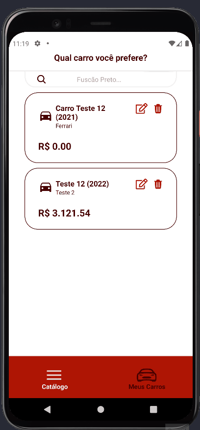

<h1 align='center'>
  Catálogo de Carros
</h1>
<p align='center'>
  
  
  
  
</p>
<p align="center">Já pensou em um aplicativo que você pode criar o seu próprio carro, editar e deletar o seu e dos outros?</p>

### Acesso Rápido

- <a href="#demonstração">Demonstração do Aplicativo</a>
- <a href="#tecnologias">Tecnologias</a>
- <a href="#teste-do-aplicativo-com-qr-code">Teste do Aplicativo com QR Code</a>
- <a href="#pré-requisitos-para-testar-localmente">Pré-requisitos para Testar Localmente</a>
- <a href="#rodando-o-app-localmente">Rodando o App Localmente</a>

---

### Demonstração do Aplicativo



Também foi feito todo o design do app no Figma.
[Clique aqui para acessar o arquivo no Figma](https://www.figma.com/file/ap3yCsm1W9ICeheGxjIJ5i/Cars) e ver o design.

<a href="https://www.figma.com/file/ap3yCsm1W9ICeheGxjIJ5i/Cars"></a>

<br>

### Tecnologias

Abaixo estão as tecnologias e bibliotecas mais complexas utilizadas neste projeto.

- [Expo](https://docs.expo.dev/) - Fácil acesso para testar o app e uma boa escolha para projetos simples e que não requer muitas funções nativas do Android.
- [React Native](https://reactnative.dev/docs/getting-started) - Linguagem multiplataforma, conectada ao expo
- [React Native Size Matters](https://github.com/nirsky/react-native-size-matters) - Biblioteca para Responsividade entre tamanho de telas entre diferentes celulares
- [Axios](https://axios-http.com/) - Muito utilizado para requisições API em geral, confiavel e com suporte contínuo.
- [React Navigation](https://reactnavigation.org/) - Mesmo existindo varias bibliotecas essa é a mais utilizada pela comunidade e sempre se mantém atualizada a cada atualização
- [Formik](https://formik.org/) - Formik se destaca pela facilidade de fazer formulários além de ter se adaptado aos Hooks
- [Styled Components](https://styled-components.com/) - Mesmo sendo uma biblioteca que se depreciar vai dar um trabalho para refatorar, essa biblioteca dificlmente irá depreciar pois tem uma grande comunidade e se mantém atualizada, além que o visual dela se compara aos códigos em CSS.

<br>

### Teste do Aplicativo com QR Code

Você pode baixar no seu celular o [Aplicativo Expo Go](https://github.com/CaueFidelis) e testar ele no seu celular ao invés de rodar localmente, assim fica até mais facil para testar. Abaixo você verá o QR code e o link para copiar e colar no [Aplicativo Expo Go](https://github.com/CaueFidelis).


[https://expo.dev/accounts/cauef/projects/catalog-cars/builds/6b8b3e8f-2ed2-440c-9ab4-5ad4888fb7ea](https://expo.dev/accounts/cauef/projects/catalog-cars/builds/6b8b3e8f-2ed2-440c-9ab4-5ad4888fb7ea)

### Pré-requisitos para Testar Localmente

Antes de começar, você vai precisar ter instalado em sua máquina as seguintes ferramentas:
[Expo CLI](https://docs.expo.dev/get-started/installation/), [Git](https://git-scm.com), [Node.js](https://nodejs.org/pt-br/) e [Firebase CLI](https://firebase.google.com/docs/cli).

Além disto é bom ter um editor para trabalhar com o código como o [VSCode](https://code.visualstudio.com/)

<br>

### Rodando o App Localmente

```bash
  # Clone este repositório
  $ git clone https://github.com/CaueFidelis/whichcar.git

  # Acesse a pasta do projeto no terminal/cmd
  $ cd car-catolog

  # Instale as dependências
  $ yarn install ou npm install

  # Execute a aplicação em modo de desenvolvimento
  $ yarn start ou npm run start

  # E se preferir pode também fazer a build, mas certifique-se de estar logado no expo
  $ yarn build ou npm run build
```

<br>
